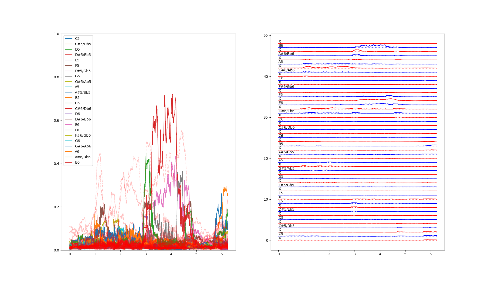
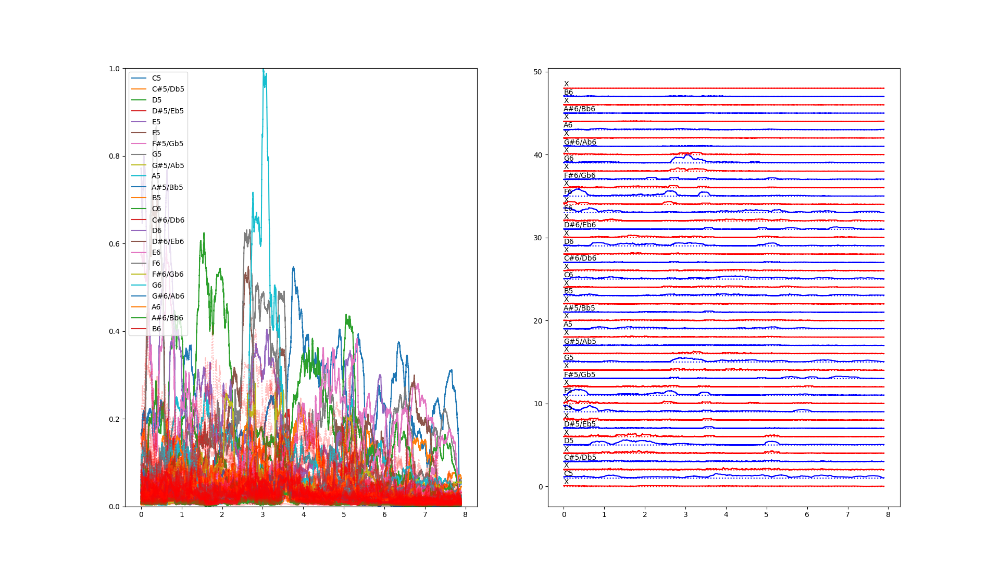
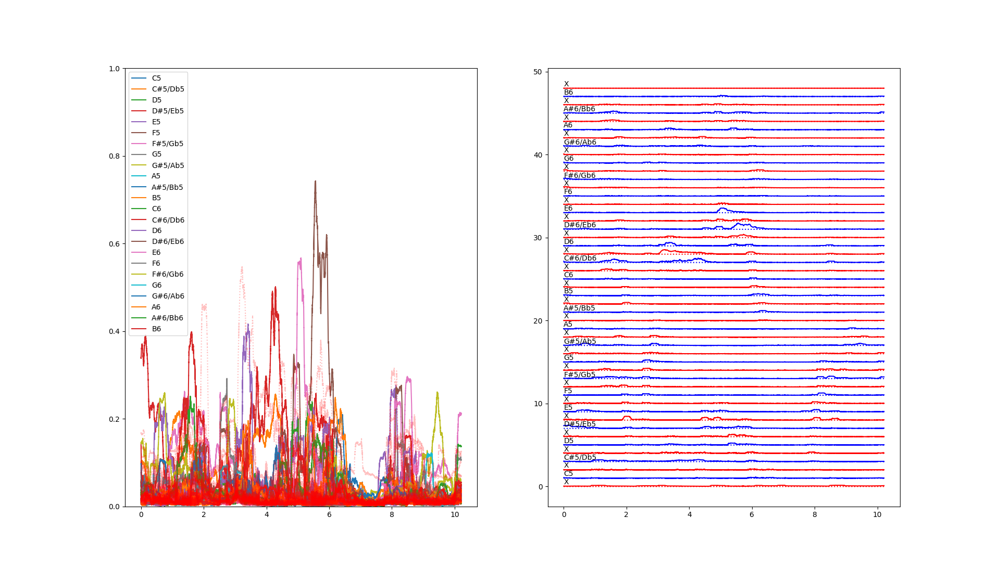

# Music Notes

WAV Source: [Hunter Flynn - You deserve it all](https://www.youtube.com/watch?v=WjuqwcEsJDY)

Singer Wikipedia page: [Hunter Flynn webpage](https://hunterflynn.com/)

Singer's Youtube: [Hunter Flynn](https://www.youtube.com/@hunterflynn)

Note: C7 (full voice, very clean, damn boy...)

WAV Source: [Darinka Rolincova - Strasidla](https://youtu.be/G0r06nbJoQ8?si=8l0269eAmpx9y7QM&t=49)

Singer Wikipedia page: [Dara Rolins](https://en.wikipedia.org/wiki/Dara_Rolins)

Singer's Youtube: [Dara Rolins](https://www.youtube.com/channel/UCMKV1A4A7p090CREb5NVbug) and [Darina Rolincova](https://www.youtube.com/@darinarolincova7719)

Note: B6 (full voice, no falsetto, nor "cat in heat sound", roughly one second length)

WAV Source: [David Archuleta - Angels We Have Heard On High](https://youtu.be/VFh-UtMzpi0?si=0bXwt203csPaKHIn&t=111)

Singer Wikipedia page: [David Archuleta](https://en.wikipedia.org/wiki/David_Archuleta)

Singer's Youtube: [David Archuleta](https://www.youtube.com/channel/UC75d1FNP1qR0lCY1usRKQEw)

Note: G6 (full voice, very clean, he can obviously go higher...)

WAV Source: [Mariah Carey - Love takes time](https://www.youtube.com/watch?v=FkDpwF6-QiA)

Singer Wikipedia page: [Mariah Carey](https://en.wikipedia.org/wiki/Mariah_Carey)

Singer's Youtube: [Mariah Carey](https://www.youtube.com/channel/UCurpiDXSkcUbgdMwHNZkrCg)

Note: E6 (full voice, pretty clean, not sure if she can go higher, I don't have all the albums...)

[Notes frequencies](https://homes.luddy.indiana.edu/donbyrd/Teach/MusicalPitchesTable.htm)
