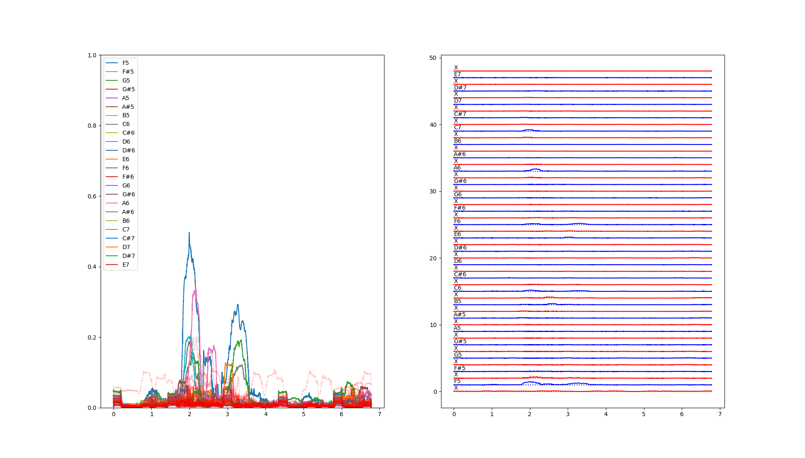

# Music Notes from my favourite singers

WAV Source: [Hunter Flynn - You deserve it all](https://www.youtube.com/watch?v=WjuqwcEsJDY)

Singer Wikipedia page: [Hunter Flynn webpage](https://hunterflynn.com/)

Singer's Youtube: [Hunter Flynn](https://www.youtube.com/@hunterflynn)

Note: C7 (full voice, very clean, damn boy...)

Number of concert attented by me: 0

WAV Source: [Darinka Rolincova - Strasidla](https://youtu.be/G0r06nbJoQ8?si=8l0269eAmpx9y7QM&t=49)

Singer Wikipedia page: [Dara Rolins](https://en.wikipedia.org/wiki/Dara_Rolins)

Singer's Youtube: [Dara Rolins](https://www.youtube.com/channel/UCMKV1A4A7p090CREb5NVbug) and [Darina Rolincova](https://www.youtube.com/@darinarolincova7719)

Note: B6 (full voice, no falsetto, nor "cat in heat sound", roughly one second length. Dara is my #1, but we both lived in the same country for a while so she had unfair starting position...)

Number of concert attented by me: Beyond 5

WAV Source: [David Archuleta - Angels We Have Heard On High](https://youtu.be/VFh-UtMzpi0?si=0bXwt203csPaKHIn&t=111)

Singer Wikipedia page: [David Archuleta](https://en.wikipedia.org/wiki/David_Archuleta)

Singer's Youtube: [David Archuleta](https://www.youtube.com/channel/UC75d1FNP1qR0lCY1usRKQEw)

Note: G6 (full voice, very clean, he can obviously go higher...)

Number of concert attented by me: Beyond 5

WAV Source: [Kelly Clarkson - Favorite Kind Of High](https://www.youtube.com/watch?v=AuPV2hk5Ekg)

Singer Wikipedia page: [Kelly Clarkson](https://en.wikipedia.org/wiki/Kelly_Clarkson)

Singer's Youtube: [Kelly Clarkson](https://www.youtube.com/channel/UCoRUmyNL8KEYftmxRA2n3SQ)

Note: F#6 (full voice, very clean, very long, she can SING amazingly on recordings and live as well...)

Number of concert attented by me: 1

WAV Source: [Celine Dion - All By Myself](https://www.youtube.com/watch?v=NGrLb6W5YOM)

Singer Wikipedia page: [Celine Dion](https://en.wikipedia.org/wiki/Celine_Dion)

Singer's Youtube: [Celine Dion](https://www.youtube.com/channel/UC_yGU4qz9zAjEWLQxCg9NZQ)

Note: F6 (Going to Celine's concert can be little annoying. She sounds like her recordings. This is HUGE compliment. Oh yeah, F6. Who cares though. It's Celine.)

Number of concert attented by me: 1

WAV Source: [Mariah Carey - Love takes time](https://www.youtube.com/watch?v=FkDpwF6-QiA)

Singer Wikipedia page: [Mariah Carey](https://en.wikipedia.org/wiki/Mariah_Carey)

Singer's Youtube: [Mariah Carey](https://www.youtube.com/channel/UCurpiDXSkcUbgdMwHNZkrCg)

Note: E6 (full voice, pretty clean, not sure if she can go higher, I don't have all the albums...)

Number of concert attented by me: 0

WAV Source: [Matteo Bocelli - Can You Feel the Love Tonight](https://www.youtube.com/watch?v=tnTtj7zDX38)

Singer Wikipedia page: [Matteo Bocelli](https://es.wikipedia.org/wiki/Matteo_Bocelli)

Singer's Youtube: [Matteo Bocelli](https://www.youtube.com/channel/UCGjtLJZa5JoDC06qApK-tvQ)

Note: D6 (my singing ethalon, i really like the way he sings)

Number of concert attented by me: 0

WAV Source: [Beyoncé - Halo](https://www.youtube.com/watch?v=bnVUHWCynig)

Singer Wikipedia page: [Beyoncé](https://www.youtube.com/channel/UCuHzBCaKmtaLcRAOoazhCPA)

Singer's Youtube: [Beyoncé](https://en.wikipedia.org/wiki/Beyonc%C3%A9)

Note: A5 (it's beyonce, no words needed... I can see your Halo girl ;) )

Number of concert attented by me: 0

WAV Source: [Haley Reinhart - White Rabbit](https://www.youtube.com/watch?v=JUnN73nooxs)

Singer Wikipedia page: [Haley Reinhart](https://en.wikipedia.org/wiki/Haley_Reinhart)

Singer's Youtube: [Haley Reinhart](https://www.youtube.com/channel/UCwXYEA4cQYBSqYQDkN5xQzA)

Note: G5 (full voice, who cares about notes when you sing amazingly like Haley...)

Number of concert attented by me: 1

WAV Source: [Whitney Houston - My Love Is Your Love](https://www.youtube.com/watch?v=kxZD0VQvfqU)

Singer Wikipedia page: [Whitney Houston](https://en.wikipedia.org/wiki/Whitney_Houston)

Singer's Youtube: [Whitney Houston](https://www.youtube.com/channel/UC7fzrpTArAqDHuB3Hbmd_CQ)

Note: F5 (one of the most amazing pop songs, one of the most amazing lyrics, one of the most amazing voices. Sang perfectly with full soul ON. I don't know who sang background vocal, but hat down as well for that lady...)

Number of concert attented by me: 0

## References

[Notes frequencies](https://homes.luddy.indiana.edu/donbyrd/Teach/MusicalPitchesTable.htm)

